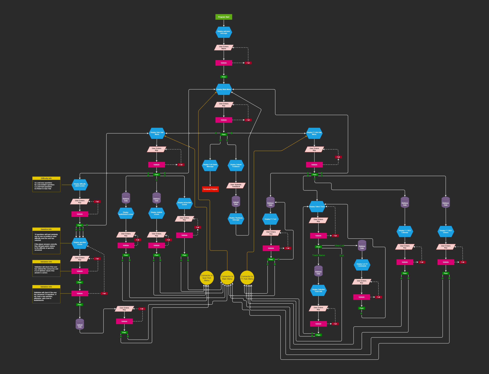

# **_The Formula 1 Hub - Project Portfolio 3 - Python_**

The Formula 1 Hub is a command line interface styled application that allows players to test their knowledge on Formula 1. The quiz consists of 3 different levels to choose from, granting more points for harder difficulties. The quiz has 10 questions for each difficulty and if the player answers all questions, they will receive points based on the difficulty selected. Additionally the Formula 1 Hub will allow players to view additional information regarding the upcoming Formula 1 2022 Season such as the current drivers, the 2022 calendar and some interesting Formula 1 facts.

You can view the live site here - <a href="https://mr-project-portfolio-3.herokuapp.com/" target="_blank" rel="noopener">The F1 Hub</a>

# Contents

* [**Objective**](<#objective>)
* [**User Experience UX**](<#user-experience-ux>)
    * [Design Prototype](<#design-prototype>)
    * [Site Structure](<#site-structure>)
    * [Python Logic](<#python-logic>)
    * [Design Choices](<#design-choices>)
    *  [Typography](<#typography>)
    *  [Colour Scheme](<#colour-scheme>)
* [**Features**](<#features>)
    * [Startup Display](<#startup-display>)
    * [Main Menu](<#main-menu>)
    * [Quiz Hub Menu](<#quiz-hub-menu>)
    * [Quiz](<#quiz>)
    * [Quiz Leaderboards](<#quiz-leaderboards>)
    * [Quiz Statistics](<#quiz-statistics>)
    * [Quiz Rules](<#quiz-rules>)
    * [F1 Info Hub Menu](<#f1-info-hub-menu>)
    * [View F1 Fact](<#view-f1-fact>)
    * [Select A Track](<#select-a-track>)
    * [F1 2022 Calendar](<#f1-2022-calendar>)
    * [F1 2022 Drivers](<#f1-2022-drivers>)
    * [Submit Feedback](<#submit-feedback>)
    * [Exit App](<#exit-app>)
* [**Future Features**](<#future-features>)
    * [Latest News](<#latest-news>)
    * [Polls](<#polls>)
* [**Technologies Used**](<#technologies-used>)
* [**Testing**](<#testing>)
* [**Deployment**](<#deployment>)
* [**Credits**](<#credits>)
    * [**Content**](<#content>)
    * [**Media**](<#media>)
    * [**Code**](<#code>)
*  [**Acknowledgments**](<#acknowledgements>)
*  [**Personal Development**](<#personal-development>)

# Objective

In my third project, I intend to create a visually appealing command line interface application where players can test their knowledge on Formula 1 and also provide some insightful, interesting and useful information regarding the upcoming 2022 season. The main objective is to demonstrate competency in Python whilst adhering to high presentation standards.

[Back to top](<#contents>)

# User Experience (UX)

## Design Prototype

The very first design prototype was created using [Balsamiq](https://balsamiq.com/). I only designed the very bare minimum using this program so that I could have a basic idea of what I wanted to achieve. Additionally because this is a command line interface application, there is only a small amount of room to come up with ideas on how to present it so I decided that I wanted the command line interface to be housed within a computer screen to give it a more presentable look and then I would add a Formula 1 styled background to enhance the visual appearance.  

[Back to top](<#contents>)

## Site Structure

The Formula 1 Hub is a one-page website that, in the center, has a command line interface. When the application starts up, the player will be greeted with a nicely styled initial startup screen and then asked to enter a username. The application is designed with the user experience in mind so at every stage, the user will be asked if they wish to return to either the Quiz Hub Menu, F1 Info Hub Menu or the Main Menu. The application also has a 'RUN APP' button located at the bottom of the screen which the user can press and reload the application if they wish to do so.

## Python Logic

I decided to create a logic flow chart to detail the entire flow of the application. Creating this gave me a brilliant overview of how everything works and how the user will navigate the application. The logic flow chart was created using an excellent [VSCode](https://code.visualstudio.com/) extension called [Draw.io](https://marketplace.visualstudio.com/items?itemName=hediet.vscode-drawio).

## Design Choices

 * ### Typography
      The main additional typography chosen to enhance the site was to introduce ASCI art to add an additional dynamic to the presentation. The ASCI art was used for the start-up display and the thank you message when the user exits the application. 

 * ### Colour Scheme
      The application utilises a brilliant Python package called [Colorama](https://pypi.org/project/colorama/) which allows developers to change the colour of the text   

## Existing Features
  * ### Startup Display

      * Explain feature here  

<b>Startup Display Image</b>

 

[Back to top](<#contents>)

  * ### Main Menu

      * Explain feature here  

<b>Main Menu Image</b>

 

[Back to top](<#contents>)

  * ### Quiz Hub Menu

      * Explain feature here  

<b>Quiz Hub Menu Image</b>

 

[Back to top](<#contents>)

  * ### Quiz

      * Explain feature here  

<b>Quiz Image</b>

 

<b>Quiz Completed Image</b>

 

[Back to top](<#contents>)

  * ### Quiz Leaderboards

      * Explain feature here  

<b>Quiz Leaderboards Image</b>

 

[Back to top](<#contents>)

  * ### Quiz Statistics

      * Explain feature here  

<b>Quiz Statistics Image</b>

 

[Back to top](<#contents>)

  * ### Quiz Rules

      * Explain feature here  

<b>Quiz Rules Image</b>

 

[Back to top](<#contents>)

  * ### F1 Info Hub Menu

      * Explain feature here  

<b>F1 Info Hub Menu Image</b>

 

[Back to top](<#contents>)

  * ### View F1 Fact

      * Explain feature here  

<b>View F1 Fact Image</b>

 

[Back to top](<#contents>)

  * ### Select A Track

      * Explain feature here  

<b>Select A Track Image</b>

 

<b>View List Image</b>

 

<b>Track Info Image</b>

 

[Back to top](<#contents>)

  * ### F1 2022 Calendar

      * Explain feature here  

<b>F1 2022 Calendar Image</b>

 

[Back to top](<#contents>)

  * ### F1 2022 Drivers 
      * Explain feature here  

<b>F1 2022 Drivers Image</b>

 

[Back to top](<#contents>)

  * ### Submit Feedback

      * Explain feature here  

<b>Submit Feedback Image</b>

 

<b>Submitted Feedback Image</b>

 

[Back to top](<#contents>)

  * ### Exit App

      * Explain feature here  

<b>Exit App Image</b>

 

[Back to top](<#contents>)

* ## Future Features 

* ### Latest News

    * Explain feature here

* ### Polls

    * Explain feature here

# Technologies Used
* [HTML5](https://en.wikipedia.org/wiki/HTML) - Provides the content and structure for the website.
* [CSS3](https://en.wikipedia.org/wiki/CSS) - Provides the styling for the website.
* [Python](https://en.wikipedia.org/wiki/Python_(programming_language)) - Provides the functionality of the website.
* [a11y](https://color.a11y.com/Contrast/) - Used to test the contrast and accessibility.
* [Favicon](https://favicon.io/) - Used to create the favicon.
* [Compressor](https://compressor.io/) - Used to compress the images.
* [VSCode](https://code.visualstudio.com/) - Used to create and edit the website.
* [GitHub](https://github.com/) - Used to host and deploy the website.
* [GitBash](https://en.wikipedia.org/wiki/Bash_(Unix_shell)) - Terminal used to push changes to the GitHub repository.
* [removebg](https://www.remove.bg/) - Used to remove background images.
* [Google Chrome DevTools](https://developer.chrome.com/docs/devtools/) - Used to test responsiveness and debug.
* [Responsive Design Checker](https://www.responsivedesignchecker.com/) - Used to test responsiveness.
* [Balsamiq](https://balsamiq.com/) - Used to create the wire-frame.
* [Draw.io](https://marketplace.visualstudio.com/items?itemName=hediet.vscode-drawio) - Used to create the logic flow chart.
* [Trello](https://trello.com/en-GB) - Used as a project management tool to organise my work flow.
* [Google Sheets](https://www.google.co.uk/sheets/about/) - Used to host the application data.
* [GSpread](https://pypi.org/project/gspread/) - Used to transfer data between google sheets.
* [Colorama](https://pypi.org/project/colorama/) - Used to add colours to the terminal.
* [Random](https://docs.python.org/3/library/random.html) - Used to implement pseudo-random number generators.
* [Datetime](https://docs.python.org/3/library/datetime.html) - Used to manipulate dates and times.
* [OS](https://docs.python.org/3/library/os.html) - Used to provide a way of using operating system dependent functionality.
* [Time](https://docs.python.org/3/library/time.html) - Used to provide various time-related functions.
* [Sys](https://docs.python.org/3/library/sys.html) - Used to provide access to some variables used or maintained by the interpreter.
* [Tabulate](https://pypi.org/project/tabulate/) - Used to print data in a nice table format.

[Back to top](<#contents>)

# Testing

* ## Code Validation

    * The Formula 1 Hub code has been validated by using online validation tools [W3C HTML Validator](https://validator.w3.org/), [W3C CSS Validator](https://jigsaw.w3.org/css-validator/) and the [PEP8 Online Validator](http://pep8online.com/). I encountered many PEP8 errors and warnings however these have now been fixed and documented below.   

    * As the JavaScript for this project has been provided by [Code Institute](https://codeinstitute.net/) and I have not altered it in any way, I have been advised by my mentor that it is not a requirement to test it.

* ### HTML Validation Image

    

* ### CSS Validation Image

    

* ### PEP8 Validation Image (run.py)

    

* ### PEP8 Validation Image (print.py)

    

* ### PEP8 Validation Image (questions.py)

    

* ## Lighthouse Testing 

    * Furthermore the website has been through the [Chrome Dev Tools](https://developer.chrome.com/docs/devtools/) and [Microsoft Edge Dev Tools](https://docs.microsoft.com/en-us/microsoft-edge/devtools-guide-chromium/open/?tabs=cmd-Windows) Lighthouse Testing which tests the website for the following:
        * Performance - How the page performs whilst loading.
        * Accessibility - Is the site accessible for all players and how can it be improved.
        * Best Practices - Site conforms to industry best practices.
        * SEO - Search Engine Optimisation. Is the site optimised for search engine result rankings.

    * The lighthouse tests were conducted in incognito/private windows due to extensions interfering with the results.  

* ### Edge Desktop Lighthouse Result

    

* ### Edge Mobile Lighthouse Result

    

* ### Chrome Desktop Lighthouse Result

    

* ### Chrome Mobile Lighthouse Result

    

* ## Accessibility Testing
    * I also put the website through [a11y](https://color.a11y.com/Contrast/) to further test the contrast and found no issues.   

    

* ## Responsiveness Testing
    * Although this project is not required to be fully responsive, I still conducted responsive tests manually with [Google Chrome DevTools](https://developer.chrome.com/docs/devtools/) and [Responsive Design Checker](https://www.responsivedesignchecker.com/).  

    

* ## Compressing Images
    * All images that are displayed within the website have been compressed with [Compressor](https://compressor.io/) and I managed to save a total of XXX KB.  

    

* ## Manual Testing
    * In addition to the other tests, I have conducted a manual check list for myself to carry out to make sure that everything is working as intended.

   * ### Manual Tests Conducted
      * Startup Display
        * Verify step here
      * Main Menu
        * Verify step here
          

* ## Browser Compatibility
    * The website has had manual and responsive tests conducted on the below browsers with additional Lighthouse testing on Google Chrome and Microsoft Edge and I was presented with no issues.
        * Google Chrome
        * Microsoft Edge
        * Safari
          

[Back to top](<#contents>)

* ## Bugs Fixed 

    ### Bug Fixed 1
        
    * Insert bug here   

    

<b>Bug Fixed 1</b>

    
    
 

    * Insert explanation here   

* ## Bugs Unresolved

    ### Bug unresolved 1
    
    * Insert bug here   

    
    
    * Insert explanation here   

[Back to top](<#contents>)

# Deployment

### **To deploy the project**
The site was deployed to Heroku. The steps to deploy a site are as follows:
  1. Insert deployment steps here

<b>Git Deploy Preview Image</b>

### **To fork the repository on GitHub**
A copy of the GitHub Repository can be made by forking the GitHub account. This copy can be viewed and changes can be made to the copy without affecting the original repository. Take the following steps to fork the repository;
1. Log in to **GitHub** and locate the [repository](https://github.com/MikeR94/CI-Project-Portfolio-3).
2. On the right-hand side of the page inline with the repository name is a button called **'Fork'**, click on the button to create a copy of the original repository in your GitHub Account.

<b>Git Fork Preview Image</b>

### **To create a local clone of this project**
The method from cloning a project from GitHub is below:

1. Under the repository’s name, click on the **code** tab.
2. In the **Clone with HTTPS** section, click on the clipboard icon to copy the given URL.
3. In your IDE of choice, open **Git Bash**.
4. Change the current working directory to the location where you want the cloned directory to be made.
5. Type **git clone**, and then paste the URL copied from GitHub.
6. Press **enter** and the local clone will be created.

<b>Git Clone Preview Image</b>

The live link to the Github repository can be found here - https://github.com/MikeR94/CI-Project-Portfolio-3

[Back to top](<#contents>)

# Credits
### Content

* The responsive preview image at the top of the README.md came from [Techsini](https://techsini.com/multi-mockup/index.php)
* The favicon came from [Favicon](https://favicon.io/)

### Media
* The photos were compressed using [Compressor](https://compressor.io/)

### Code
* Insert code here

[Back to top](<#contents>)