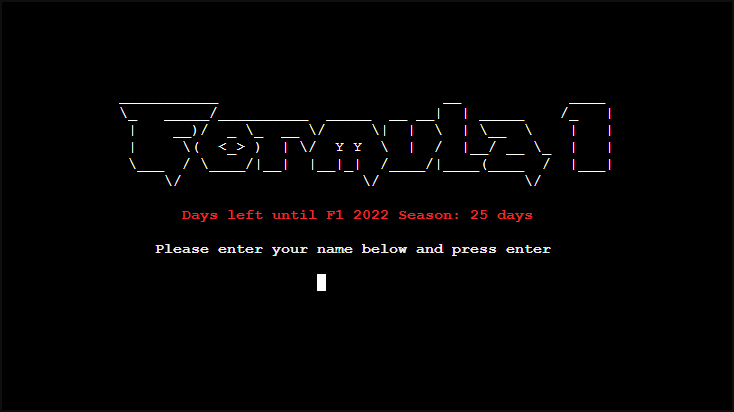

# **_The Formula 1 Hub - Project Portfolio 3 - Python_**

The Formula 1 Hub is a command line interface styled application that allows players to test their knowledge on Formula 1. The quiz consists of 3 different levels to choose from, granting more points for harder difficulties. The quiz has 10 questions for each difficulty and if the player answers all questions, they will receive points based on the difficulty selected. Additionally the Formula 1 Hub will allow players to view additional information regarding the upcoming Formula 1 2022 Season such as the current drivers, the 2022 calendar and some interesting Formula 1 facts.

You can view the live site here - <a href="https://mr-project-portfolio-3.herokuapp.com/" target="_blank" rel="noopener">The Formula 1 Hub</a>

# Contents

* [**Objective**](<#objective>)
* [**User Experience UX**](<#user-experience-ux>)
    * [Design Prototype](<#design-prototype>)
    * [Site Structure](<#site-structure>)
    * [Python Logic](<#python-logic>)
    * [Data Model](<#data-model>)
    * [Design Choices](<#design-choices>)
    *  [Typography](<#typography>)
    *  [Colour Scheme](<#colour-scheme>)
    * [Project Management](<#project-management>)
* [**Features**](<#features>)
    * [Startup Display](<#startup-display>)
    * [Main Menu](<#main-menu>)
    * [Quiz Hub Menu](<#quiz-hub-menu>)
    * [Select Difficulty](<#select-difficulty>)
    * [Quiz](<#quiz>)
    * [Quiz Leaderboards](<#quiz-leaderboards>)
    * [Quiz Statistics](<#quiz-statistics>)
    * [Quiz Rules](<#quiz-rules>)
    * [F1 Info Hub Menu](<#f1-info-hub-menu>)
    * [View F1 Fact](<#view-f1-fact>)
    * [Select A Track](<#select-a-track>)
    * [F1 2022 Calendar](<#f1-2022-calendar>)
    * [F1 2022 Drivers](<#f1-2022-drivers>)
    * [Submit Feedback](<#submit-feedback>)
    * [Exit App](<#exit-app>)
* [**Future Features**](<#future-features>)
    * [Latest News](<#latest-news>)
    * [Polls](<#polls>)
* [**Technologies Used**](<#technologies-used>)
* [**Python Packages**](<#python-packages>)
* [**Testing**](<#testing>)
* [**Deployment To Heroku**](<#deployment-to-heroku>)
* [**Credits**](<#credits>)
    * [**Content**](<#content>)
    * [**Media**](<#media>)
    * [**Code**](<#code>)
*  [**Acknowledgments**](<#acknowledgements>)
*  [**Personal Development**](<#personal-development>)

# Objective

In my third project, I intend to create a visually appealing command line interface application where players can test their knowledge on Formula 1 and also provide some insightful, interesting and useful information regarding the upcoming 2022 season. The main objective is to demonstrate competency in Python whilst adhering to high presentation standards.

[Back to top](<#contents>)

# User Experience (UX)

## Design Prototype

The very first design prototype was created using [Balsamiq](https://balsamiq.com/). I only designed the very bare minimum using this program so that I could have a basic idea of what I wanted to achieve. Additionally because this is a command line interface application, there is only a small amount of room to come up with ideas on how to present it so I decided that I wanted the command line interface to be housed within a computer screen to give it a more presentable look and then I would add a Formula 1 styled background to enhance the visual appearance.  

[Back to top](<#contents>)

## Site Structure

The Formula 1 Hub is a one-page website that, in the center, has a command line interface. When the application starts up, the player will be greeted with a nicely styled initial startup screen and then asked to enter a username. The application is designed with the user experience in mind so at every stage, the user will be asked if they wish to return to either the Quiz Hub Menu, F1 Info Hub Menu or the Main Menu. The application also has a 'RUN APP' button located at the bottom of the screen which the user can press and reload the application if they wish to do so.

## Python Logic

I decided to create a logic flow chart to detail the entire flow of the application. Creating this gave me a brilliant overview of how everything works and how the user will navigate the application. The logic flow chart was created using an excellent [VSCode](https://code.visualstudio.com/) extension called [Draw.io](https://marketplace.visualstudio.com/items?itemName=hediet.vscode-drawio).

## Data Model

I used [Google Sheets](https://www.google.co.uk/sheets/about/) to store all the data for the Formula 1 Hub application. This acted as my primary database where data would be sent to and also retrieved from. The [Google Sheet](https://www.google.co.uk/sheets/about/) had 7 separate worksheets, all of which had a different task. 

* *Leaderboard* - Used to store users scores and holds information such as **Name**, **Score**, **Correct**, **Incorrect**, **Difficulty** and **Date**. This sheet is sorted by column B, **Score**.
* *Feedback* - Used to store all feedback that the user submits.
* *Facts* - Used to store interesting F1 facts and one will be picked at random to be presented to the user.
* *Drivers* - Used to store information about the F1 2022 drivers. This includes details such as **Name**, **Current Team**, **Wins**, **Pole Positions** and **Career Points**. This sheet is sorted by column E, **Career Points**.
* *Calendar* - Used to store the current F1 2022 calendar. This includes details such as the **Date**, **Grand Prix** and **Venue**. This sheet is sorted by column A, *Date*.
* *Track Info* - Used to store all data about the F1 2022 tracks. I have stored the name of the track into a variable which retrieves the information about that track by referencing the appropriate range within the worksheet.
* *Commands* - Used to store a simple list of commands that the user can enter on the Select Track display.

## Design Choices

 * ### Typography
      The main additional typography chosen to enhance the site was to introduce ASCI art to add an additional dynamic to the presentation. The ASCI art was used for the start-up display and the thank you message when the user exits the application. 

 * ### Colour Scheme
      The application utilises a brilliant Python package called [Colorama](https://pypi.org/project/colorama/) which allows developers to change the colour of the text.  

## Project Management

 * ### Trello
      I used an excellent application called [Trello](https://trello.com/en-GB) which greatly improved organisation and productivity. This tool allows the individual to properly plan and create a systematic work flow so you are always aware of what needs to be done next.

      I would first create a very basic overview of what I wanted to achieve and then break it down into smaller more manageable steps. Before finishing for the day, I would spend at least 15 minutes planning for the next day so that when I came back to developing I could open my Trello board and instantly get back developing since I would know immediately what I need to be working on. I highly recommend this tool to any developer or development team.   

 * ### Excel
      I use [Microsoft Excel](https://www.microsoft.com/en-us/microsoft-365/excel) to organise to and create any files that have a lot of data. I use Excel as it allows me to visually organise things in a way so that it is much more easily readable and understandable so that when I come to transfer that information into my projects, I know exactly what has and has not been entered. This worked especially well for tracking all of my quiz questions and splitting them into their respective categories.   

## Existing Features
  * ### Startup Display

      * This is the first display that the user will see when they first load the website.
      * ASCI art has been created to display a visually appealing Formula 1 title to further reinforce the purpose of the application.
      * The user is asked to enter their name which will be validated.
      * An automatic countdown to the F1 2022 season is displayed to the user and will display "F1 2022 Season has started" in bold green text when the days left are less than or equal to 0.  

<b>Startup Display Image</b>

 

[Back to top](<#contents>)

  * ### Main Menu

      * This is the highest level of the application that the user will see when they have entered their name.
      * It allows users to either go down the Quiz route or the F1 Info route.
      * Alternatively they can submit feedback through this menu and also exit the application.  

<b>Main Menu Image</b>

 

[Back to top](<#contents>)

  * ### Quiz Hub Menu

      * This is the Quiz Hub Menu which hosts all options for the user to navigate regarding the quiz itself.
      * The user has the option to either Start the Quiz, View the Leaderboards, View the Quiz Statistics, View the Quiz rules or Return back to the main menu if they wish to do so.  

<b>Quiz Hub Menu Image</b>

 

[Back to top](<#contents>)

  * ### Select Difficulty

      * This is where the user can choose to select the difficulty level for the quiz.
      * If the user wishes to return back to the Quiz Hub Menu, then they have that option so they aren't forced to start the quiz if they aren't yet ready to do so.  

<b>Select Difficulty Image</b>

 

[Back to top](<#contents>)

  * ### Quiz

      * This is the main interactive game that the user will be able to participate in.
      * The user will be asked 10 random questions of their selected difficulty, earning points for correct answers relative to the difficulty selected.
      * If the user answers correctly, a green "Correct answer!" will show.
      * If the user answers incorrectly, a red "Incorrect answer" will show.
      * If the user enters a wrong key, they will be informed and allowed to attempt the question again.
      * Upon completion of the quiz, the users score will be submitted automatically to the leaderboard.  

<b>Quiz Image</b>

 

<b>Quiz Completed Image</b>

 

[Back to top](<#contents>)

  * ### Quiz Leaderboards

      * Displays the top 8 scores in order of highest score to lowest. I chose to display 8 scores and not 10 to keep the presentation of the application neat and tidy.
      * Provides additional information to the user such as the users name, their score, how many correct and incorrect answers they achieved, the difficulty they selected and also the date they conducted the quiz.  

<b>Quiz Leaderboards Image</b>

 

[Back to top](<#contents>)

  * ### Quiz Statistics

      * Displays interesting statistical information regarding the quiz such as how many games have been played, how many overall points have been accumulated and also how many correct and incorrect answers have been given.
      * I was very proud of implementing this feature so I have provided an image of the code that shows the inner workings of displaying the statistics to the user.  

<b>Quiz Statistics Image</b>

 

<b>Quiz Statistics Code Image</b>

 

[Back to top](<#contents>)

  * ### Quiz Rules

      * A simple display explaining the basic rules when playing the quiz.  

<b>Quiz Rules Image</b>

 

[Back to top](<#contents>)

  * ### F1 Info Hub Menu

      * This is the F1 Info Hub Menu which hosts all options for the user to navigate regarding the F1 Info Hub section.
      * The user has the option to either View an F1 Fact, Select a Track, View the F1 2022 Calendar, View the F1 2022 Drivers or Return back to the main menu.  

<b>F1 Info Hub Menu Image</b>

 

[Back to top](<#contents>)

  * ### View F1 Fact

      * This feature will retrieve and display a random fact to the user.
      * The user has the option to continuously load a new fact if they wish to do so.  

<b>View F1 Fact Image</b>

 

[Back to top](<#contents>)

  * ### Select A Track

      * The initial display the user will see when they press B from the F1 Info Hub will be the first image below.
      * If the user then types **view list** they will then be provided with a list of commands that they enter.
      * If the user successfully types in a correct track name, the user will be provided information about that specific track.
      * The information the user will be able to see will be **Name**, **Location**, **Length**, **Turns**, **Race Lap Record**, **Capacity**, **2021 Pole Position** and **2021 Race Winner**.
      * This information is retrieved from the [Google Sheets](https://www.google.co.uk/sheets/about/) database and stores information about every track for the F1 2022 Season.  

<b>Select A Track Image</b>

 

<b>View List Image</b>

 

<b>Track Info Image</b>

 

[Back to top](<#contents>)

  * ### F1 2022 Calendar

      * A simple yet useful feature the user can use to retrieve the dates and locations of the F1 2022 Season Calendar.  

<b>F1 2022 Calendar Image</b>

 

[Back to top](<#contents>)

  * ### F1 2022 Drivers 
      
      * Displays all the F1 2022 Drivers in order of career points.
      * The user will be able to see the following information about each driver. **Name**, **Current Team**, **Wins**, **Pole Positions** and **Career Points**.  

<b>F1 2022 Drivers Image</b>

 

[Back to top](<#contents>)

  * ### Submit Feedback

      * A feature for the user to submit any type of feedback they wish to.
      * All feedback gets stored in the [Google Sheets](https://www.google.co.uk/sheets/about/) database and can be viewed by myself.
      * A small thank you message is displayed to the user upon submitting their feedback and they will then be returned to the main menu.  

<b>Submit Feedback Image</b>

 

<b>Submitted Feedback Image</b>

 

<b>Submitted Feedback GIF</b>

 

[Back to top](<#contents>)

  * ### Exit App

      * If the user has finished using the application, they can choose to terminate the application by selecting D on the main menu.
      * This will then display a thank you message to the user and then shutdown the application.  

<b>Exit App Image</b>

 

[Back to top](<#contents>)

* ## Future Features 

* ### Latest News

    * An update to display the latest live Formula 1 2022 news would be very informative for the users and also increase user retention.

* ### Polls

    * Allowing users to participate in daily/weekly/monthly polls would increase user activity and also glean interesting data that could be used to understand what the majority feels about a certain subject.

# Technologies Used
* [HTML5](https://en.wikipedia.org/wiki/HTML) - Provides the content and structure for the website.
* [CSS3](https://en.wikipedia.org/wiki/CSS) - Provides the styling for the website.
* [Python](https://en.wikipedia.org/wiki/Python_(programming_language)) - Provides the functionality of the website.
* [a11y](https://color.a11y.com/Contrast/) - Used to test the contrast and accessibility.
* [Favicon](https://favicon.io/) - Used to create the favicon.
* [Compressor](https://compressor.io/) - Used to compress the images.
* [VSCode](https://code.visualstudio.com/) - Used to create and edit the website.
* [GitHub](https://github.com/) - Used to host and deploy the website.
* [GitBash](https://en.wikipedia.org/wiki/Bash_(Unix_shell)) - Terminal used to push changes to the GitHub repository.
* [removebg](https://www.remove.bg/) - Used to remove background images.
* [Google Chrome DevTools](https://developer.chrome.com/docs/devtools/) - Used to test responsiveness and debug.
* [Responsive Design Checker](https://www.responsivedesignchecker.com/) - Used to test responsiveness.
* [Balsamiq](https://balsamiq.com/) - Used to create the wire-frame.
* [Draw.io](https://marketplace.visualstudio.com/items?itemName=hediet.vscode-drawio) - Used to create the logic flow chart.
* [Trello](https://trello.com/en-GB) - Used as a project management tool to organise my work flow.
* [Microsoft Excel](https://www.microsoft.com/en-us/microsoft-365/excel) - Used to create spreadsheets to easily view data.
* [Google Sheets](https://www.google.co.uk/sheets/about/) - Used to host the application data.

# Python Packages

* [GSpread](https://pypi.org/project/gspread/) - Used to transfer data between google sheets.
* [Colorama](https://pypi.org/project/colorama/) - Used to add colours to the terminal.
* [Random](https://docs.python.org/3/library/random.html) - Used to implement pseudo-random number generators.
* [Datetime](https://docs.python.org/3/library/datetime.html) - Used to manipulate dates and times.
* [OS](https://docs.python.org/3/library/os.html) - Used to provide a way of using operating system dependent functionality.
* [Time](https://docs.python.org/3/library/time.html) - Used to provide various time-related functions.
* [Sys](https://docs.python.org/3/library/sys.html) - Used to provide access to some variables used or maintained by the interpreter.
* [Tabulate](https://pypi.org/project/tabulate/) - Used to print data in a nice table format.

[Back to top](<#contents>)

# Testing

* ## Code Validation

    * The Formula 1 Hub code has been validated by using online validation tools [W3C HTML Validator](https://validator.w3.org/), [W3C CSS Validator](https://jigsaw.w3.org/css-validator/) and the [PEP8 Online Validator](http://pep8online.com/). I encountered many PEP8 errors and warnings however these have now been fixed and documented below. 

    * As the JavaScript for this project has been provided by [Code Institute](https://codeinstitute.net/) and I have not altered it in any way, I have been advised by my mentor that it is not a requirement to test it.

    * ***Please note*** - Although I have added a new line at the end of the file, when copying and pasting the code from [GitHub](https://github.com/) into the [PEP8 Online Validator](http://pep8online.com/), one warning will appear for each file. This warning is the "no new line at end of file" warning. I do have a new line at the end of the file however it seems that when I push my code to [GitHub](https://github.com/) then that line is automatically removed.

* ### HTML Validation Image

    

* ### CSS Validation Image

    

* ### PEP8 Validation Image (run.py)

    

* ### PEP8 Validation Image (print.py)

    

* ### PEP8 Validation Image (questions.py)

    

* ## Lighthouse Testing 

    * Furthermore the website has been through the [Chrome Dev Tools](https://developer.chrome.com/docs/devtools/) and [Microsoft Edge Dev Tools](https://docs.microsoft.com/en-us/microsoft-edge/devtools-guide-chromium/open/?tabs=cmd-Windows) Lighthouse Testing which tests the website for the following:
        * Performance - How the page performs whilst loading.
        * Accessibility - Is the site accessible for all players and how can it be improved.
        * Best Practices - Site conforms to industry best practices.
        * SEO - Search Engine Optimisation. Is the site optimised for search engine result rankings.

    * The lighthouse tests were conducted in incognito/private windows due to extensions interfering with the results.  

* ### Edge Desktop Lighthouse Result

    

* ### Edge Mobile Lighthouse Result

    

* ### Chrome Desktop Lighthouse Result

    

* ### Chrome Mobile Lighthouse Result

    

* ## Accessibility Testing
    * I also put the website through [a11y](https://color.a11y.com/Contrast/) to further test the contrast and found no issues.   

    

* ## Responsiveness Testing
    * Although this project is not required to be fully responsive, I still conducted responsive tests manually with [Google Chrome DevTools](https://developer.chrome.com/docs/devtools/) and [Responsive Design Checker](https://www.responsivedesignchecker.com/).  

    

    * If the device does not meet the required dimensions to support the application, the user will be presented with the below image. I feel this is a much nicer way of dealing with devices that don't meet the required dimensions as it doesn't allow the user to view the website when certain elements won't render properly.

    

* ## Compressing Images
    * All images that are displayed within the website have been compressed with [Compressor](https://compressor.io/) and I managed to save a total of 538 KB.  

    

* ## Manual Testing
    * In addition to the other tests, I have conducted a manual check list for myself to carry out to make sure that everything is working as intended.

   * ### Manual Tests Conducted
      * **Startup Display**
        * Verify that the F1 countdown text counts down correctly and that it will change when the days are <= 0.
        * Verify that the user validation is working as intended.
        * Verify that if the user enters a correct name, they will move to the Main Menu.
      * **Main Menu**
        * Verify that the users name is displayed at the top of the page.
        * Verify that the user receives an invalid input message if an incorrect key has been entered.
        * Verify that all menu options load as intended only if the user enters the appropriate key.
      * **Quiz Hub Menu**
        * Verify that the users name is displayed at the top of the page.
        * Verify that the user receives an invalid input message if an incorrect key has been entered.
        * Verify that all menu options load as intended only if the user enters the appropriate key.
      * **F1 Info Hub Menu**
        * Verify that the users name is displayed at the top of the page.
        * Verify that the user receives an invalid input message if an incorrect key has been entered.
        * Verify that all menu options load as intended only if the user enters the appropriate key.
      * **Select Difficulty**
        * Verify that the user receives an invalid input message if an incorrect key has been entered.
        * Verify that all menu options load as intended only if the user enters the appropriate key.
        * Verify that the user receives an invalid input message if an incorrect key has been entered.
      * **Quiz**
        * Verify that the correct difficulty questions are presented to the user.
        * Verify that only one question is loaded at a time.
        * Verify that the user receives an invalid input message if an incorrect key has been entered and then the question is displayed again.
        * Verify that the user receives a correct answer message if they answer a question correctly.
        * Verify that the user receives an incorrect answer message if they answer a question incorrectly.
        * Verify that when all questions have been answered, the user is receives a tailored message that represents their quiz results.
        * Verify that the users score is submitted correctly to the leaderboards.
      * **Quiz Leaderboards**
        * Verify that the leaderboards are displayed correctly and only show the top 8 highest scores in order of highest to lowest.
        * Verify that the user receives an invalid input message if an incorrect key has been entered.
      * **Quiz Statistics**
        * Verify that the statistics for the quiz are displayed correctly and the numbers are accurate.
        * Verify that the user receives an invalid input message if an incorrect key has been entered.
      * **Quiz Rules**
        * Verify that the quiz rules are displayed correctly to the user.
        * Verify that the user receives an invalid input message if an incorrect key has been entered.
      * **View F1 Fact**
        * Verify that only one fact is displayed to the user.
        * Verify that if the user chooses to load a new fact then a new fact is presented.
        * Verify that the user receives an invalid input message if an incorrect key has been entered.
      * **Select A Track**
        * Verify that if the user types in "view list" then the commands are presented to the user.
        * Verify that if the user types in a correct track name then that specific track data is presented to the user.
        * Verify that if the user types in "exit" then it will return the user back to the F1 Quiz Hub Menu.
        * Verify that the user receives an invalid input message if an incorrect key has been entered.
      * **F1 2022 Calendar**
        * Verify that the F1 2022 Calendar is presented to the user in the correct order of dates.
        * Verify that the user receives an invalid input message if an incorrect key has been entered.
      * **F1 2022 Drivers**
        * Verify that the F1 2022 Drivers list is presented to the user in the correct order of career points highest to lowest.
        * Verify that the user receives an invalid input message if an incorrect key has been entered.
      * **Submit Feedback**
        * Verify that when the user submits feedback, the message is stored within the google sheets database.
        * Verify that when the user submits feedback, the user is then redirected back to the main menu.
        * Verify that the user receives an invalid input message if an incorrect key has been entered.
      * **Exit App**
        * Verify that when the user exits the app, they are presented with a thank you message and then the program shuts down successfully.
        * Verify that the user receives an invalid input message if an incorrect key has been entered.
          

* ## Browser Compatibility
    * The website has had manual and responsive tests conducted on the below browsers with additional Lighthouse testing on Google Chrome and Microsoft Edge and I was presented with no issues.
        * Google Chrome
        * Microsoft Edge
        * Safari
          

[Back to top](<#contents>)

* ## Bugs Fixed 

    ### Leaderboards not updating properly
        
    * When the user has finished the quiz, their score would be uploaded to the leaderboard. If the user then returned back to the Quiz Hub Menu and then selected View the leaderboards, the leaderboards would not sort in order of highest to lowest by column B (score) even though I had the code written and in the right place.
    
    * After about an hour of trying to understand why this was happening, I decided to reference the worksheet again within the code that was responsible for viewing the leaderboards. Thankfully, this solved the issue.   

    

    ### PEP8 Warnings and Errors
        
    * When I put my code through the [PEP8 Online Validator](http://pep8online.com/checkresult) I was presented the below warnings and errors multiple times.   

    

    

    

    
    
    * After understanding the warnings and errors, I spent time refactoring the code to fix everything. Now I have zero warnings and errors when I put all of my Python files through the [PEP8 Online Validator](http://pep8online.com/checkresult).

* ## Bugs Unresolved

    ### User entering keys fast

    * If the user enters a correct key multiple times extremely fast then the program will register every key and just keep loading the next available display relative to the key pressed. 

    * My idea for fixing this issue was to implement a function that will enable and then disable user input where appropriate. Unfortunately, I was unable to implement this. I did find a brilliant solution which involved importing the keyboard module but for some reason I was unable to import the module.

    * This isn't entirely a "bug" in the sense that the application breaks or something doesn't work as intended however it's more of a quality user flow control issue which would be very nice if I could implement to prevent users spam pressing keys.

    ### navigator.userAgent/appVersion and platform
    
    * When inspecting the website with [Google Chrome DevTools](https://developer.chrome.com/docs/devtools/), the website is showing one issue which is the same issue I had on my Project Portfolio 1 and Project Portfolio 2 so I'm familiar with it.  

    
    
    * I've done some research and apparently this is a Google Chrome issue as per this [source](https://forum.codewithmosh.com/t/the-ultimate-javascript-console-issue-at-beginning-of-course/6535) and has been reported [here](https://githubmemory.com/repo/zalmoxisus/redux-devtools-extension/issues/808). Additionally, I have tested this website with Microsoft Edge and the issue doesn't show.

[Back to top](<#contents>)

# Deployment To Heroku
  
The project was deployed to [Heroku](https://www.heroku.com). The deployment process is as follows: 
  
1. Log in to Heroku or create an account if required.

<b>Heroku Step 1</b>

 

2. Click the button labeled New from the dashboard in the top right corner, just below the header and then select "Create new app".

<b>Heroku Step 2</b>

 

3. Enter a unique application name and then select your region. Once you are ready, click "Create app".

<b>Heroku Step 3</b>

 

4. This will bring you to the project "Deploy" tab. From here, click the "Settings" tab and scroll down to the "Config Vars" section and click on "Reveal Config Vars". In the KEY input field, enter "PORT" and in the VALUE input field, enter "8000". After that, click the "Add" button to the right.

<b>Heroku Step 4</b>

 

5. Scroll down to the buildpacks section of the settings page and click the button "Add buildpack".

<b>Heroku Step 5</b>

 

6. Add both "Python" and "node.js" and make sure that Python is above node.js. If it isn't you can just drag it above.

<b>Heroku Step 6</b>

 

7. Scroll back to the top of the settings page, and navigate to the "Deploy" tab. Select Github as the deployment method.

<b>Heroku Step 7</b>

 

8. Search for the repository name and click the connect button next to the intended repository.

<b>Heroku Step 8</b>

 

9. From the bottom of the deploy page select your preferred deployment type. I personally enabled automatic deployments. After that, click "Deploy Branch".

<b>Heroku Step 9</b>

 

The live link to the Github repository can be found here - https://github.com/MikeR94/CI-Project-Portfolio-3

[Back to top](<#contents>)

# Credits
### Content

* The responsive preview image at the top of the README.md came from [Techsini](https://techsini.com/multi-mockup/index.php).
* The questions for the Formula 1 Quiz came [WeLoveQuizzes](https://www.welovequizzes.com/formula-1-quiz-questions-and-answers/), [Express](https://www.express.co.uk/sport/f1-autosport/1277159/F1-quiz-questions-and-answers-trivia), [FreePubQuiz](http://www.freepubquiz.co.uk/F1-quiz.html) and [Quiz-Questions](https://quiz-questions.uk/f1-quiz/). I also added questions of my own.
* Information stored within [Google Sheets](https://www.google.co.uk/sheets/about/) that is presented to the user was from [AutoSport](https://www.autosport.com/f1/news/everything-we-know-about-the-2022-formula-1-season-drivers-cars-tracks-more/6868204/), [Racing Statistics](https://www.racing-statistics.com/en/f1-drivers), [Formula 1](https://www.formula1.com/en/results.html/2021/races.html) and [Wikipedia](https://en.wikipedia.org/wiki/Main_Page).

### Media
* The photos were compressed using [Compressor](https://compressor.io/).
* The Formula 1 background image came from [WallPaperBat](https://wallpaperbat.com/f1-race-tracks-wallpapers).
* The computer image that contains the terminal came from [Pngall](https://www.pngall.com/wp-content/uploads/4/LCD-Computer-Monitor-PNG-Image.png).
* The favicon image came from [encrypted-tbn0](https://encrypted-tbn0.gstatic.com/images?q=tbn:ANd9GcTjtOmemr76GOUK79y3itlIDr5bYfWiS-F2xixdV1qg4e9WI8POOvZ0TV06TKCmL7zE3Ko&usqp=CAU) and then turned into a favicon by [Favicon](https://favicon.io/).

### Code
* When first deciding that I wanted to make an F1 Quiz, I simply googled "How can I create a quiz game in Python?". This incredible article by [Brock Byrd](https://brockbyrdd.medium.com/) gave me the foundations I needed to begin creating my quiz. I used the foundations of his [Article](https://brockbyrdd.medium.com/creating-a-multiple-choice-quiz-in-python-terminal-1c46123b86d5) and then heavily modified it by adding multiple different features, one of which was allowing the user to select a difficulty. 

* I also thought it would be prudent to document but a few of my many googled questions so that future developers can see the power of seeking advice and searching for answers on the internet. Some of the questions I googled are the following:

    * How do I clear the terminal in python? [Link](https://stackoverflow.com/questions/5367068/clear-a-terminal-screen-for-real)
    * How do I add a time delay in Python? [Link](https://www.geeksforgeeks.org/how-to-add-time-delay-in-python/)
    * How do I add colours to the Python terminal? [Link](https://www.geeksforgeeks.org/print-colors-python-terminal/)
    * How do I add a date countdown in Python? [Link](https://www.sololearn.com/Discuss/1530780/how-can-i-get-python-to-countdown-to-a-set-date-in-the-future)
    * How can I print my [Google Sheets](https://www.google.co.uk/sheets/about/) table nicely in Python? [Link](https://www.delftstack.com/howto/python/data-in-table-format-python/)
    * How do I shutdown my Python program? [Link](https://stackoverflow.com/questions/2823472/is-there-a-method-that-tells-my-program-to-quit)
    * How can I add randomness in Python? [Link](https://www.geeksforgeeks.org/python-random-sample-function/)
    * How can I add the date the user has submitted feedback and or completed the quiz? [Link](https://docs.python.org/3/library/datetime.html#strftime-strptime-behavior)

[Back to top](<#contents>)

# Acknowledgments
The site was completed as a part of a Full Stack Software Developer Diploma at the [Code Institute](https://codeinstitute.net/) and is my Portfolio Project 3. I would like to thank my mentor [Precious Ijege](https://www.linkedin.com/in/precious-ijege-908a00168/), my educator [Luke Walters](https://www.linkedin.com/in/luke-walters-leatherbarrow-531107101/), and my brother [Jack Ralph](https://www.linkedin.com/in/jackthomasralph/), the Slack community, and all at the Code Institute for their help and support.

# Personal Development
After developing a project in JavaScript and then moving to Python, I found to learning curve to be incredibly easier as the syntax is very easily readable. I learnt the power of proper project management and I feel like I understand the fundamentals of Python. Creating this project was an immense amount of fun and because I decided to create another project which I am passionate about, it made the whole experience so much more enjoyable. I understand that I have only scratched the surface with Python but I can now understand why it is currently the most popular programming language in the world today.

Moving forward, I will retain and put to use all of the skills I have learnt during this project to not only better myself but to better others around me.

I hope you enjoyed my Formula 1 project and thank you very much for your time.

Mike Ralph 2022.

[Back to top](<#contents>)